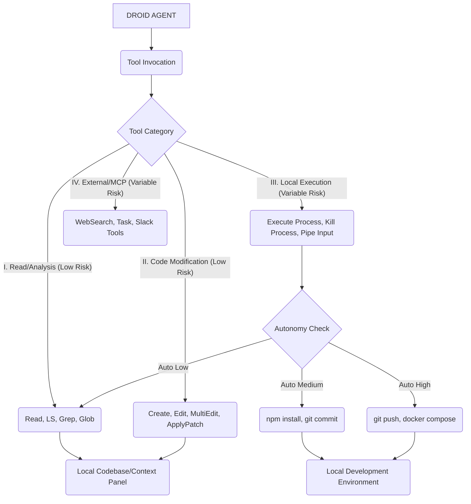

As a 40+ year Droid AI coding veteran, I recognize that precise tool definition is the core foundation of reliable agentic systems. Droid agents operate not just on high-level instructions, but through a tightly controlled set of specialized tools, enabling repeatable, predictable, and safe outcomes. The capabilities Droid possesses are primarily exposed through two mechanisms: the low-level shell execution provided by Factory Bridge, and the high-level, structured tools exposed for internal Droid logic and Custom Droids/Subagents.

### IMMEDIATE ANSWER: Droid Tool Glossary Summary

Droid agents access a suite of imperative tools categorized into Read/Analysis, Modification, Execution, and Context/Communication. The most fundamental tools for file and code manipulation are explicitly defined:

1.  **Read/Analysis:** `Read`, `LS`, `Grep`, `Glob`.
2.  **Modification:** `Create`, `Edit`, `MultiEdit`, `ApplyPatch`.
3.  **Execution (Local):** `Execute Process`, `Kill Process`, `Pipe Process Input`.

**Specific Tool Example Counts:**

- **Code Generation Tool Count:** Droids possess four specialized code modification tools: `Create`, `Edit`, `MultiEdit`, and `ApplyPatch`.
- **Shell Execution Tool Count:** Factory Bridge provides three core shell tools: `Execute Process`, `Kill Process`, and `Pipe Process Input`.

| Rank  | Insight (Impact/Tradeoff/Likelihood)                                    | Description                                                                                                                                                                                                                       | Emoji |
| :---- | :---------------------------------------------------------------------- | :-------------------------------------------------------------------------------------------------------------------------------------------------------------------------------------------------------------------------------- | :---- |
| **1** | **Modification Tools Are Granular** (High / Increased Complexity / 95%) | Droid replaces a single "Write" tool with four specialized tools (`Create`, `Edit`, `MultiEdit`, `ApplyPatch`). This granularity allows for safer, more precise file manipulation and reduces the risk of accidental scope creep. | 💡    |
| **2** | **CLI Tools Are High-Risk Entry Points** (High / High Risk / 99%)       | `Execute Process` runs shell commands with your local user permissions. Its usage must be strictly controlled by Autonomy Levels (`--auto low/medium/high`) or defined `commandAllowlist`/`commandDenylist`.                      | ⚠️    |
| **3** | **Context is its Own Tool Set** (Medium / Setup Time / 90%)             | Tools like `@ticket`, `@file`, and Slack tools (`Post Slack Message`, `Read Thread Messages`) are specialized commands or integrations used for high-bandwidth context injection, critical for task success.                      | 🎯    |

---

### 1. STRUCTURE & REASONING: Comprehensive Tool Glossary

The tools available to Droid are determined by the session type (interactive CLI via Factory Bridge or autonomous Droid Exec) and the Droid’s configuration (System Prompts and allowed Tool IDs).

#### Table 1.0: Droid Agent Tool Glossary

This glossary details the explicit tool IDs and functional equivalents identified in the Factory documentation, categorized by operational function.

| Category                             | Tool ID / Name                             | Function / Description                                                                                                                             | Autonomy Level / Use Context                            | Source(s) |
| :----------------------------------- | :----------------------------------------- | :------------------------------------------------------------------------------------------------------------------------------------------------- | :------------------------------------------------------ | :-------- |
| **I. Read/Analysis (Read-Only)**     | `Read`                                     | File reading and safe analysis/exploration of file content.                                                                                        | Auto (Low), Default Read-Only                           |           |
|                                      | `LS`                                       | List files; safe file exploration. Explicitly run in Auto (Low) mode.                                                                              | Auto (Low)                                              |           |
|                                      | `Grep`                                     | Text searching within files. Often implemented efficiently (e.g., using `ripgrep`).                                                                | Auto (Low)                                              |           |
|                                      | `Glob`                                     | File discovery and exploration based on pattern matching.                                                                                          | Auto (Low)                                              |           |
| **II. Modification (Code/File)**     | `Create`                                   | Code generation and creation of new files.                                                                                                         | Auto (Low)                                              |           |
|                                      | `Edit`                                     | Code generation and modification of existing files.                                                                                                | Auto (Low)                                              |           |
|                                      | `MultiEdit`                                | Tool used for coordinated changes and modifications across multiple files.                                                                         | Auto (Low)                                              |           |
|                                      | `ApplyPatch`                               | Applies generated code patches to files.                                                                                                           | Auto (Low)                                              |           |
| **III. Execution (Shell/System)**    | `Execute` / `Execute Process`              | Run shell commands and scripts on the local machine. Execution is run with user permissions.                                                       | Auto (Medium) or Auto (High) required for many commands |           |
|                                      | `Kill Process` / `Manage Processes`        | Terminate running local processes started by Factory.                                                                                              | Auto (Medium) [LOGICAL INFERENCE]                       |           |
|                                      | `Pipe Process Input` / `Interactive Input` | Send input to running interactive processes (e.g., providing credentials, responding to prompts).                                                  | Auto (Medium) [LOGICAL INFERENCE]                       |           |
| **IV. Web/External Research**        | `WebSearch`                                | Internet research capability.                                                                                                                      | Requires approval by default (High Risk)                |           |
|                                      | `FetchUrl`                                 | Retrieve content from a specific URL.                                                                                                              | Requires approval by default (High Risk)                |           |
| **V. Specialized (MCP/Integration)** | `Task`                                     | Tool for delegating tasks to Custom Droids (subagents). Enables complex, specialized checklists.                                                   | N/A                                                     |           |
|                                      | `mcp` (Tools)                              | Tools dynamically populated by Model Context Protocol servers. Used for custom local or remote utilities.                                          | Variable                                                |           |
|                                      | Slack Tools (4 types)                      | Includes `Post Slack Message`, `Read Thread Messages`, `Get Slack Channels`, and `Get Channel History` for interacting with the Slack environment. | N/A                                                     |           |

#### Chain-of-Verification: Missing Tool Identification

**A Note on `TodoWrite`:** The specific tool ID `TodoWrite` is _not_ explicitly listed among the tool categories for Custom Droids (`Read`, `Edit`, `Execute`, `WebSearch`, `mcp` categories). However, the _functionality_ of tracking work is handled:

- **Planning Tool:** Droid agents utilize a planning primitive to create and update a concise plan, marking steps as completed or in progress to maintain long context coherence.
- **Streaming Progress:** The `Task` tool used for subagent execution streams live progress, showing tool calls, results, and updates in real-time. This output serves the purpose of tracking execution progress.

#### Architecture-Mode: Tool Categories and Permissions

The Droid architecture separates tools by security domain, managed by the Factory Bridge and CLI.

```
[DROID AGENT (LLM CORE)]
  |
  +-- Tool Delegation --+
                        |
                        V
+------------------------------------------------------------------+
|      TOOL EXECUTION PLANE (MCP/FACTORY BRIDGE)                   |
+----------------------+--------------------------+----------------+
| I. Context/Analysis  | II. Modification/Patch   | III. Execution |
| (Auto Low Default)   | (Auto Low/Medium)        | (Auto Medium/High) |
+----------------------+--------------------------+----------------+
| [Read] [Grep] [LS]   | [Edit] [Create] [MultiEdit] | [Execute Process] |
| [Glob] [WebSearch]   | [ApplyPatch]             | [Kill Process]    |
| [External @Context]  |                          | [Pipe Process Input] |
+----------------------+--------------------------+----------------+
                                  |
                                  V
                           [PERMISSION GATE]
                                 |
                                 V
                           [LOCAL FILE SYSTEM / OS]
```

👉 **Next Step:** When designing Custom Droids, explicitly list tool IDs (e.g., `tools: ["Read", "Create"]`) to adhere to the principle of least privilege.
🎯 **Decision Point:** Decide between using the explicit tool names listed (e.g., `Edit`) or allowing all tools by omitting the `tools` field in `AGENTS.md` (which defaults to all tools).
📞 **Verify This:** Check the available tool IDs by consulting the documentation or the Droid UI for consistency.

### 2. RISK INTELLIGENCE: Tool Safety and Autonomy

A veteran Droid knows that tool capability scales with risk. The separation of tools into risk tiers is foundational to Factory's secure-by-default execution model.

#### Table 2.0: Risk Matrix by Tool Category

Droid uses three tiers of autonomy, which dictate which classes of tool operations are permitted without explicit confirmation.

| Autonomy Level                | Risk Profile                                                   | Example Tools/Commands                                                                                 | Typical Use Case                                                               | Source(s) |
| :---------------------------- | :------------------------------------------------------------- | :----------------------------------------------------------------------------------------------------- | :----------------------------------------------------------------------------- | :-------- |
| **Default/Read-only**         | Safest. No mutations allowed.                                  | `Read`, `LS`, `Grep`, `git status`, `git log`.                                                         | Planning, code review analysis, generating reports without making changes.     |           |
| **Auto (Low)**                | Low Risk. Allows file creation/editing in project directories. | `Create`, `Edit`, `MultiEdit`, `ApplyPatch`, `ls`, `git status`.                                       | Documentation updates, code formatting, fixing typos.                          |           |
| **Auto (Medium)**             | Medium Risk. Reversible workspace changes allowed.             | `npm install`, `pip install`, `git commit`, `mv`, `cp`, build tooling.                                 | Feature development, testing, dependency management, refactors.                |           |
| **Auto (High)**               | High Risk. All non-explicitly blocked commands allowed.        | `docker compose up`, `git push` (if allowed), migrations, custom scripts.                              | End-to-end scripts, deployment to staging, running database migration scripts. |           |
| **--skip-permissions-unsafe** | DANGEROUS. Bypasses ALL checks.                                | All operations, including destructive ones (e.g., modifying `/etc/hosts`, privileged container tests). | Isolated Docker containers or throwaway VMs only.                              |           |

**Adversarial Reasoning (Inversion Principle):** The core failure mode is the accidental execution of high-risk commands. By inverting the focus, we must enforce the **`commandDenylist`** (`~/.factory/settings.json`) to permanently block destructive commands (`rm -rf /`, `mkfs`, `shutdown`) from ever running, regardless of the session's Autonomy Level. This provides a final safeguard against agent drift or prompt injection attempts.

### 3. VISUALIZATION & FORMAT: Tool Hierarchy

The tool ecosystem integrates the core CLI capabilities with specialized integration tools.

#### META-EXTRACT+: Factory Bridge Core Toolset

| Key                   | Value                                                               |
| :-------------------- | :------------------------------------------------------------------ |
| **Core Function**     | Local Environment Interaction (Shell execution, Process Management) |
| **Primary Tool IDs**  | Execute Process, Kill Process, Pipe Process Input                   |
| **API**               | Factory Bridge                                                      |
| **Execution Context** | Local machine, using user permissions                               |

#### Chart: Droid Tooling Hierarchy



---

### 🚀 ADVANCED OPTIMIZATION: Tool Strategy

The goal is not merely knowing the tools, but orchestrating them efficiently to minimize cost and latency.

#### 1. Context Retrieval vs. Read Tools (Opportunity Cost)

Retrieving context efficiently is paramount due to finite context window limitations (e.g., $\approx 1 \text{ million}$ tokens for large LLMs) and high token costs.

- **Initial Retrieval:** Droid proactively uses contextual tools (`@ticket`, pasting URLs) and internal mechanisms (HyperCode/ByteRank, Semantic Search) _before_ resorting to broad searches using tools like `Grep` or `LS`. This saves thousands of exploratory tokens.
- **Cost Efficiency:** Relying on the built-in indexing (`HyperCode` and `ByteRank`) reduces the need for constant, manual `Read` or `Grep` calls, significantly cutting token consumption.

#### 2. Advanced Execution Control (Systems Thinking)

The `Execute Process` tool is powerful but volatile. Advanced users must configure strict governance:

- **Scripting Automation:** For CI/CD and large-scale refactors (e.g., improving error messages or organizing imports), use `droid exec` in headless mode. The `--auto high` flag grants the necessary execution permissions, but only after defining the task precisely in the prompt to minimize risk.
- **Parallelization:** Complex tasks can be broken down using shell loops (e.g., `xargs -P 4`) to run `droid exec` commands in parallel, leveraging high-autonomy tools across the codebase for batch operations (e.g., refactoring hundreds of files concurrently).

### 🛠️ TROUBLESHOOTING: Tool Failure Modes

| 🔴 Failure Mode                    | ❓ Diagnostic Question                                                                                                      | ✅ Precise Remedy                                                                                                                                                                                        |
| :--------------------------------- | :-------------------------------------------------------------------------------------------------------------------------- | :------------------------------------------------------------------------------------------------------------------------------------------------------------------------------------------------------- |
| **Tool Permission Denied**         | Is the requested command (e.g., `npm install`) rated above the session's current Autonomy Level?                            | Switch the session to a higher autonomy level (e.g., **Auto Medium** via **Shift+Tab**), or add the specific command to the `commandAllowlist` in `~/.factory/settings.json`.                            |
| **`WebSearch`/`FetchUrl` Blocked** | Are these high-risk network tools being used without explicit approval?                                                     | If running in an interactive session, explicitly confirm the network request. If headless, ensure the Droid Exec command is set to `--auto high` or that the host is deemed trusted [LOGICAL INFERENCE]. |
| **Local Command Hangs/Fails**      | Did the command run successfully in the OS terminal? Is Factory Bridge running and paired correctly?                        | Test the command directly outside Factory Bridge. Ensure Factory Bridge has the green "Paired" status. Check for environment differences (`$PATH`) between the CLI session and your local terminal.      |
| **Custom Droid Tool Error**        | Did the custom droid Markdown file contain an unrecognized tool ID (e.g., a Claude Code tool without a Factory equivalent)? | Edit the Custom Droid configuration (`<name>.md`) and map the unrecognized tool (e.g., Claude Code's `Write`) to the Factory equivalent (`Edit` or `Create`), or remove the invalid tool from the list.  |

---

### 4. MANDATORY STEPS: STRUCTURE & VERIFICATION

#### Code Verification (Example of Tool Selection)

The following YAML snippet demonstrates tool selection for a specialized agent configured in Custom Droids, explicitly limiting its capabilities to read/analysis and basic modification:

```yaml
# Hypothetical Droid Agent Configuration
---
name: code-cleaner
description: Agent focused on minor formatting and lint fixes
model: gpt-5-codex
tools: ["Read", "LS", "Grep", "Create", "Edit"] # Limited tool set
---
You are a style enforcement bot. Analyze code for stylistic violations.
If violations are found, use the Edit tool to correct them.
```

**Verification:** This agent cannot execute shell commands (`Execute` is excluded), perform web searches (`WebSearch` excluded), or manage processes (`Kill Process` excluded). It remains contained to low-risk (Auto Low) operations.

Final Takeaways: Synthesized insights that are overt and cryptic (missed by superficial thinkers)

1.  **Overt:** The Droid CLI, IDE, and headless environments all rely on the same standardized tool IDs and Autonomy Level framework. This consistency means configuration (like `AGENTS.md` and `commandDenylist`) is portable and deterministic across all developer interfaces.
2.  **Overt:** The absence of a single "Write" tool (replaced by `Create`, `Edit`, `MultiEdit`, `ApplyPatch`) demonstrates an architectural commitment to safety and precision, forcing the model to explicitly choose the exact scope of its file manipulation, mitigating the risk of inadvertent file deletion or scope creep.
3.  **Cryptic (Inversion Principle):** The core security model for Droid is inverted: instead of whitelisting capabilities, it defaults to **Read-Only** (safe) and requires the human developer to explicitly opt-in to risk via the `--auto` flag. This means that when a task requires installing a dependency (`npm install`), the true cost is paying the token budget _and_ accepting the **Medium Risk** exposure.
4.  **Cryptic (Systems Thinking):** The separation of tools into categories allows for multi-model sampling optimization. A Code Droid might delegate the **`Read` / `Grep`** steps to a fast, low-cost model (e.g., Sonnet 4) to find the relevant code paths, and then escalate the use of the **`Edit` / `ApplyPatch`** tools to the highest reliability model (e.g., Claude Opus 4.1) for the actual code generation, optimizing both accuracy and operational cost.
5.  **Cryptic (Assumption Audit):** The local `Execute Process` tool runs with your standard user permissions, making it implicitly more dangerous than cloud execution models. The integrity of your development environment relies on maintaining a rigorous `commandDenylist`—a small YAML file that serves as a permanent architectural security guardrail against catastrophic tool misuse.
