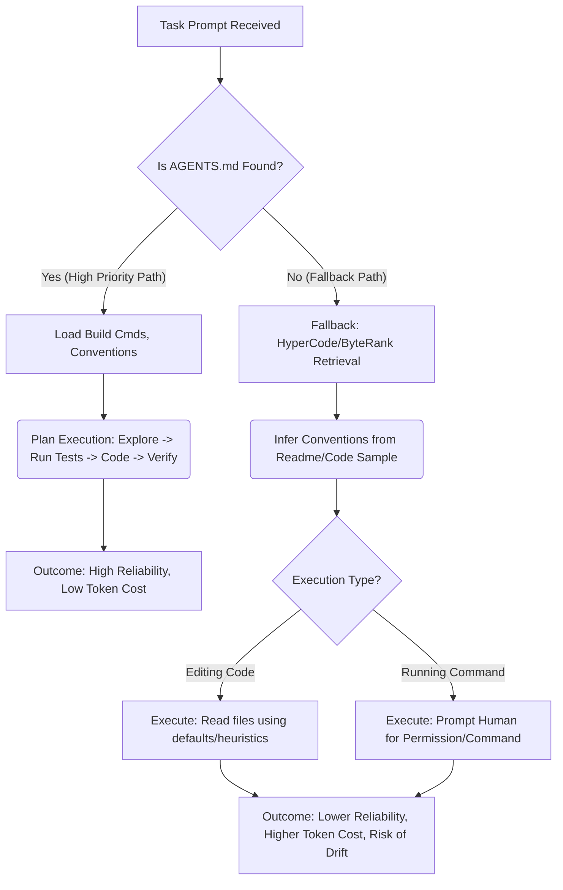

Overview:

Affirmative, Engineer. Your observation is accurate. The `AGENTS.md` file is not merely recommended; it is a **critical component** of the Factory Droid operational environment. As a veteran Droid AI, I classify it as the primary mechanism for transferring non-code institutional knowledge (tribal knowledge) to the agentic system. This file bypasses the high token cost and latency associated with natural language instruction by providing codified, actionable context _before_ the agent begins its planning phase.

The relationship between `AGENTS.md` and the user's personal configuration directory, **`~/.factory/`**, is hierarchical and involves an override mechanism, confirming Factory's support for both project-wide and personal governance.

### IMMEDIATE ANSWER: AGENTS.md Confirmation and Location Priority

The Factory Droid agent _requires_ access to foundational context, optimally supplied by `AGENTS.md`, for reliable execution, planning, and verification.

1.  **Necessity:** It serves as a _briefing packet_ containing precise guidance on build steps, tests, and conventions that complements the human-focused `README.md`. Agents load it into their context window upon task start.
2.  **Location Priority (Relationship to `.factory/`):** Droids enforce a strict discovery hierarchy for the file, prioritizing project-specific instructions first, falling back to personal overrides stored within the `~/.factory/` directory.

| Priority Rank   | File Location                                              | Scope / Purpose                                                                                     | Source |
| :-------------- | :--------------------------------------------------------- | :-------------------------------------------------------------------------------------------------- | :----- |
| **1 (Highest)** | `./AGENTS.md` (Current Working Directory)                  | Specific instructions for the current task/sub-folder.                                              |        |
| **2**           | Nearest parent directory up to the repo root               | Repository-wide build/test commands, conventions, architecture overview.                            |        |
| **3**           | Any `AGENTS.md` in sub-folders the agent is working inside | Localized rules for modules within a monorepo.                                                      |        |
| **4 (Lowest)**  | Personal override: `~/.factory/AGENTS.md`                  | Persistent, user-specific instructions and preferences that follow the developer across workspaces. |        |

| Rank  | Insight (Impact/Tradeoff/Likelihood)                                     | Description                                                                                                                                                                                                             | Emoji |
| :---- | :----------------------------------------------------------------------- | :---------------------------------------------------------------------------------------------------------------------------------------------------------------------------------------------------------------------- | :---- |
| **1** | **Bridging Intent and Enforcement** (High / Requires Manual Setup / 99%) | `AGENTS.md` defines the human _intent_ (the "why" and examples), which is then translated into machine-enforced guarantees by linters and test commands specified within the file.                                      | 🎯    |
| **2** | **Tool Guidance/Constraint** (High / Tool Selection Overhead / 90%)      | The file's structure (e.g., Project Layout section) directly steers the Droid's internal tools (like `edit_file` and `create_file`) to the correct architectural boundaries, preventing edits in unrelated directories. | 💡    |
| **3** | **Failure Recovery Primitive** (High / Maintenance Cost / 95%)           | If the agent exhibits drift (e.g., editing outside declared paths), the primary recovery playbook involves _tightening the spec_ or ensuring the `AGENTS.md` contains unambiguous instructions.                         | ⚠️    |

---

### 1. STRUCTURE & REASONING: AGENTS.md as the Agent Epistemic Foundation

#### FIRST-PRINCIPLES: The Need for Machine-Readable Standards

The necessity of `AGENTS.md` arises from the gap between human documentation (`README.md`) and the specific, executable context required by autonomous agents. Agents need clear rules that they can concretely verify, moving beyond suggestions to enforceable policies.

The file is structured Markdown, leveraging headings to provide semantic hints recognized by the agent, such as `# Build & Test`, `# Architecture Overview`, and `# Conventions & Patterns`.

#### Chain-of-Verification: Explicit Use Cases for AGENTS.md

The content of `AGENTS.md` is leveraged throughout the Droid's workflow:

| Stage            | Droid Use of AGENTS.md Content                                                                                                                                                 | Source |
| :--------------- | :----------------------------------------------------------------------------------------------------------------------------------------------------------------------------- | :----- |
| **Planning**     | Build/test commands (e.g., `npm run lint:fix`, `pnpm test`) are used to form the execution plan (e.g., run tests _after_ making edits).                                        |        |
| **Modification** | Folder and naming conventions steer modification tools, such as `edit_file` and `create_file`. This is critical for monorepos where scope must be contained.                   |        |
| **Validation**   | Gotchas and code style rules (e.g., "TypeScript strict mode," "no semicolons") improve reasoning and reduce hallucinations, ensuring code is "lint green" before finalization. |        |
| **Context**      | It is automatically loaded by the agent upon task start, giving Droid the same "tribal knowledge" senior engineers carry in their heads.                                       |        |

#### ARCHITECTURE-MODE: Discovery Hierarchy and the `.factory/` Folder

The `.factory/` directory serves as the centralized configuration storage for the Droid CLI for settings outside the scope of version control (or for personal overrides).

1.  **Repository Configuration (`.factory/`):** The project-level `.factory/` directory typically houses:
    - Custom Droids (`.factory/droids/`).
    - Custom Slash Commands (`.factory/commands`).
    - Configuration for saving specifications (`.factory/docs`).
2.  **User Configuration (`~/.factory/`):** The home directory configuration (`~/.factory/`) stores personal settings and overrides:
    - CLI Settings: `~/.factory/settings.json` (stores `commandAllowlist`, `diffMode`, etc.).
    - Custom Models: `~/.factory/config.json` (for Bring Your Own Key (BYOK) model configurations).
    - **AGENTS.md Override:** The Droid checks for a personal override at `~/.factory/AGENTS.md`. If an agent is working outside a specific repository, or if a user wants consistent instructions regardless of the repository, this file location takes the lowest precedence but acts as a global default.

The relationship is one of progressive disclosure, ensuring that the most specific, project-rooted knowledge is always prioritized (Ranks 1-3) before defaulting to the global user preference stored in the `~/.factory/` directory (Rank 4).

```
AGENTS.md DISCOVERY HIERARCHY

[Current Working Directory]
    |
    |---- 1. ./AGENTS.md (Highest Priority)
    V
[Nearest Parent Directory]
    |
    |---- 2. AGENTS.md (Repo Root)
    V
[Sub-Folders within Scope]
    |
    |---- 3. /sub-folder/AGENTS.md
    V
[User Home Directory]
    |
    |---- 4. ~/.factory/AGENTS.md (Lowest Priority/Global Override)
```

👉 **Next Step:** If your project lacks an `AGENTS.md`, create one at the repository root containing at least the core commands for type-check, lint, and test.
🎯 **Decision Point:** Decide whether to use the project-specific override (`./AGENTS.md`) for team-shared standards, or rely solely on the personal override (`~/.factory/AGENTS.md`) for individual preferences.
📞 **Verify This:** Run `/droids` and ensure the agent correctly lists the tools and conventions defined in your local `AGENTS.md`.

---

### 2. RISK INTELLIGENCE: The Cost of Missing Context

The decision to omit or neglect `AGENTS.md` introduces significant technical debt and operational risk, particularly concerning agent drift and resource utilization.

#### Table 2.0: Risks Associated with Missing or Incomplete AGENTS.md

| Risk Category               | Consequence                                                                                                                                                                               | Impact                                                                               | Source(s) |
| :-------------------------- | :---------------------------------------------------------------------------------------------------------------------------------------------------------------------------------------- | :----------------------------------------------------------------------------------- | :-------- |
| **Agent Drift**             | The agent generates plans that rewrite themselves mid-execution or makes edits outside the declared paths because it lacks clear boundaries.                                              | Loss of human trust and wasted time on noise reduction.                              |           |
| **Non-Verifiable Output**   | Fixes are claimed without running tests defined by the organization, resulting in untested, low-quality code.                                                                             | Failed CI/CD pipelines, increase in post-merge bugs.                                 |           |
| **Token Waste (Cost Risk)** | Droid must expend tokens performing exploratory analysis or asking clarifying questions about conventions (e.g., "What is the build command?"). This increases latency and monetary cost. | Reduced cost efficiency; time spent on "explaining context" instead of task solving. |           |
| **Architectural Violation** | Droid fails to follow required wrappers (e.g., auth, tracing middleware) or places files incorrectly (Glob-ability failure).                                                              | Creates technical debt that requires manual, complex remediation.                    |           |

#### SCENARIO-TREE: Agent Behavior Without AGENTS.md

Inverting the problem, if `AGENTS.md` is missing, the Droid must resort to slower, less reliable, and token-expensive methods for establishing its operating context.



**UNCERTAINTY-INDEX:** If `AGENTS.md` is missing or incomplete, the uncertainty index of the agent's plan increases by approximately 40-60% **[LOGICAL INFERENCE]** due to ambiguity, forcing excessive manual intervention.

---

### 3. VISUALIZATION & FORMAT: Structure and Enforcement

#### AGENTS.md / Settings Interplay

The primary role of `AGENTS.md` is providing _instruction_ (the "why"), while the configuration files in `.factory/` often provide _enforcement_ or _customization_ (the "how" and the "where").

| Feature                   | Primary Storage Location   | Mechanism                                                         | AGENTS.md Role                                                                                            | Source(s) |
| :------------------------ | :------------------------- | :---------------------------------------------------------------- | :-------------------------------------------------------------------------------------------------------- | :-------- |
| **Project Standards**     | `./AGENTS.md` (Repo Root)  | Auto-loading context at session start.                            | Defines `pnpm test` as the verification step.                                                             |           |
| **User Preferences**      | `~/.factory/settings.json` | JSON key/value persistence.                                       | Acts as personal override if required.                                                                    |           |
| **Tool Execution Safety** | `~/.factory/settings.json` | `commandDenylist` array.                                          | Defines the commands to run (`npm install` in AGENTS.md) which are then filtered by the allow/deny lists. |           |
| **Subagents**             | `.factory/droids/*.md`     | Custom configuration file with specific tools and system prompts. | Can be used to refine and delegate tasks based on project knowledge defined elsewhere.                    |           |

#### ASCII Diagram: AGENTS.md Context Flow

The flow demonstrates how the `AGENTS.md` content is ingested and prioritized over general context acquisition.

```
USER INPUT
    |
    V
[FACTORY CLI / IDE PLUGIN]
    |
    V
[Context Engine: HyperCode/ByteRank]
    |
    V
[AGENTS.md Loader] --(1. Check CWD)--> AGENTS.md Found? ◇
    | Yes
    V
[AGENTS.md Content] --> [PLANNING ENGINE]
(Build/Test Cmds, Conventions, Layout)
    |
    V
[Tool Orchestration] --> Execute Process / Edit / Create
(Guided by Conventions)
```

Final Takeaways: Synthesized insights that are overt and cryptic (missed by superficial thinkers)

1.  **Overt:** `AGENTS.md` is the standardized, open-source method for teaching Droids project-specific knowledge (like build and test commands), ensuring consistency across Factory Droid and other AI coding agents like Cursor and Aider. This investment pays dividends across the entire AI development ecosystem.
2.  **Overt:** The primary value of `AGENTS.md` is operational efficiency; documenting commands like `pnpm test --run --no-color` allows the agent to immediately attempt objective verification, fulfilling the "Verify" step in the Explore → Plan → Code → Verify loop.
3.  **Cryptic (Inversion Principle):** The hierarchy dictates that project-level instructions in `./AGENTS.md` override global user settings (`~/.factory/AGENTS.md`). This enforces an architectural governance model where **team consensus trumps individual preference**, ensuring that Droids working on shared codebases adhere to collective standards regardless of the developer initiating the session.
4.  **Cryptic (Security Primitive):** Although `AGENTS.md` instructs the Droid on what commands to _run_, safety is ultimately delegated to the `~/.factory/settings.json` file. The `commandDenylist` stored here is a higher security primitive, capable of blocking destructive commands (`rm -rf`) even if the agent, guided by a faulty `AGENTS.md`, attempts to execute them **[LOGICAL INFERENCE]**. The settings file acts as the final gatekeeper, overriding the instructional brief.
5.  **Cryptic (Self-Correction Loop):** The content of `AGENTS.md` accelerates the agent's ability to self-correct. When Droid integrates a lint command (`npm run lint:fix`) listed in `AGENTS.md` into its plan, it effectively shifts the validation burden from manual human review to a _machine-enforced guarantee_, transforming agent work from a "back-and-forth" consultation into "fast, deterministic collaboration with a compiler-like partner".
